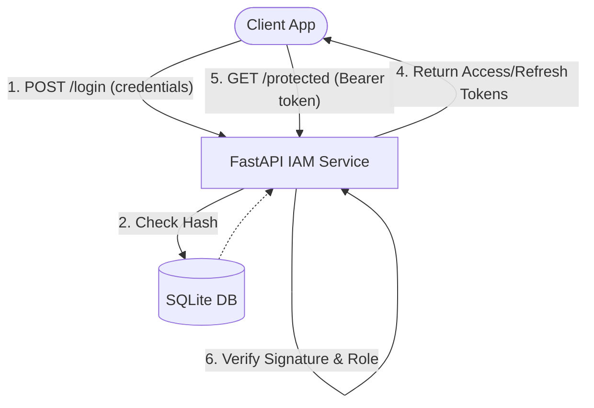

# Architecture — enterprise-iam-auth-poc-python
> Last updated: 2026-08-29 | Maturity: Partial Prototype
> _Enterprise IAM & SSO built with FastAPI._

## System Diagram
The following Mermaid.js sequence diagram maps the core workflow and interactions:



## Component Table

| Component | File | Responsibility | Tech |
|---|---|---|---|
| Auth Routes | `app/api/auth.py` | Login and Registration | FastAPI |
| SSO Routes | `app/api/sso.py` | Mock OIDC endpoints | FastAPI |
| Core Security | `app/core/security.py`| Password hashing, JWT signing | PyJWT / Passlib |
| Models | `app/db/models.py` | DB schemas for Users/Roles | SQLAlchemy |

## Dependency Honesty Table

| Dependency | Status | Notes |
|---|---|---|
| FastAPI | **Real** | Core routing and validation. |
| SQLite | **Real** | Used as a lightweight RDBMS. |
| Okta / Azure | **Simulated** | IdP integration is mocked inside `sso.py`. |


## 🏗️ Domain-Driven Design (DDD) Modularity

To demonstrate enterprise readiness, the application is strictly partitioned into distinct domains rather than lumping all logic into a single file. This ensures scalability and maintainability.

```text
app/
├── auth/           # Domain: Local Authentication
│   └── routes.py   # Registration & standard login endpoints
├── core/           # Domain: Infrastructure & Global Configuration
│   ├── config.py   # Environment variable management (Pydantic Settings)
│   └── security.py # Crypto functions (bcrypt hashing, JWT signing)
├── models/         # Domain: Data Layer
│   ├── schemas.py  # Pydantic validation schemas (DTOs)
│   └── user.py     # SQLAlchemy ORM models
├── rbac/           # Domain: Authorization
│   └── dependencies.py # Role validation logic using FastAPI Depends
├── sso/            # Domain: Federated Identity
│   └── routes.py   # OIDC/OAuth2 mock endpoints
├── db.py           # Database connection & session management
└── main.py         # Application factory
```

## 🔐 Security Deep Dive

### 1. Password Hashing
We utilize `passlib` with the `bcrypt` algorithm. Passwords are never stored in plain text. Hashing occurs at the boundary (the register route) before data reaches the database.

### 2. JSON Web Tokens (JWT)
Upon successful login, a JWT is generated. 
- **Payload (`claims`)**: Contains the `sub` (subject/email), `exp` (expiration timestamp), and `roles` (list of roles).
- **Statelessness**: Because the token contains the roles and is cryptographically signed, the server does not need to query the database to verify a user's permissions on subsequent requests, drastically reducing latency.

### 3. Role-Based Access Control (RBAC)
We implemented a dynamic `RoleChecker` class designed to be used as a FastAPI dependency.
```python
allow_admin_only = RoleChecker(["admin"])
@app.get("/admin", dependencies=[Depends(allow_admin_only)])
```
This pattern separates the business logic of the endpoint from the security logic, keeping routes clean and making authorization policies highly reusable.

### 4. Database (SQLAlchemy)
The PoC uses SQLite for ease of distribution, but by using the SQLAlchemy ORM, transitioning to an enterprise relational database like PostgreSQL or MySQL is as simple as changing the `SQLALCHEMY_DATABASE_URI` environment variable.

## 🌐 SSO (Single Sign-On) Simulation
Enterprise environments rarely rely solely on local databases. The `/api/v1/sso` domain mocks a standard OAuth2 authorization code flow. 
- It demonstrates the concept of redirecting a user to an Identity Provider (IdP) and then exchanging an authorization code for an internal session token.